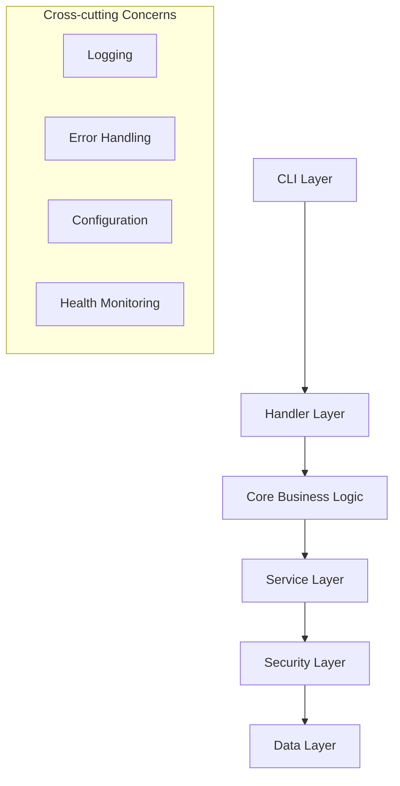

# Git ### 📖 Core Documentation
| Document | Purpose | Audience |
|----------|---------|----------|
| [README.md](../README.md) | Complete user guide with installation, usage, and examples | All users |
| [Installation Guide](INSTALLATION.md) | Comprehensive installation and build procedures | All users, developers |
| [Technical Overview](overview.md) | System architecture and design patterns | Developers, architects |
| [Architecture Deep Dive](ARCHITECTURE.md) | Comprehensive technical architecture analysis | Senior developers, architects |
| [API Reference](API.md) | Complete API documentation with examples | Developers, integrators |
| [Security Guide](SECURITY.md) | Comprehensive security features and best practices | Security teams, DevOps |ull Documentation

**Enterprise-grade GitHub repository batch processing with modern architecture and comprehensive security.**

## Documentation Structure

### � Core Documentation
| Document | Purpose | Audience |
|----------|---------|----------|
| [README.md](../README.md) | Complete user guide with installation, usage, and examples | All users |
| [Technical Overview](overview.md) | System architecture and design patterns | Developers, architects |
| [API Reference](API.md) | Complete API documentation with examples | Developers, integrators |
| [Security Guide](SECURITY.md) | Comprehensive security features and best practices | Security teams, DevOps |

### 🎯 Quick Navigation

#### For End Users
- **[Installation & Setup](INSTALLATION.md)** - Complete installation guide with all methods
- **[Quick Start Guide](../README.md#quick-start)** - Get started quickly
- **[CLI Reference](../README.md#cli-reference)** - Command-line interface guide
- **[Configuration](../README.md#configuration)** - Setup and customization
- **[Health Monitoring](../README.md#performance--monitoring)** - System diagnostics

#### For Developers
- **[Architecture Overview](overview.md)** - System design and patterns
- **[Architecture Deep Dive](ARCHITECTURE.md)** - Comprehensive technical architecture
- **[API Documentation](API.md)** - Programmatic interface
- **[Plugin Development](API.md#plugin-system)** - Extend functionality
- **[Contributing Guide](../README.md#contributing)** - Development workflow

#### For Security & Operations
- **[Security Architecture](SECURITY.md#security-architecture)** - Multi-layer security design
- **[Token Management](SECURITY.md#token-security)** - Secure credential handling
- **[Operational Security](SECURITY.md#operational-security)** - Deployment best practices
- **[Monitoring & Alerting](../README.md#monitoring--observability)** - Production monitoring

## System Overview

Git Batch Pull is a professional-grade CLI tool designed for enterprise environments requiring secure, scalable GitHub repository management.

### Key Capabilities

- **🏗️ Modular Architecture**: 7-layer design with dependency injection
- **🔒 Enterprise Security**: Token encryption, path validation, process sandboxing
- **⚡ High Performance**: Parallel processing with intelligent rate limiting
- **� Comprehensive Monitoring**: Health checks, structured logging, metrics
- **🔌 Extensible Platform**: Plugin system for custom workflows
- **🛡️ Production Ready**: Error recovery, resource management, audit trails

### Technical Highlights



### Architecture Principles

- **Security by Design**: Every layer implements security controls
- **Fail-Safe Defaults**: Secure configurations out of the box
- **Separation of Concerns**: Clear boundaries between components
- **Dependency Injection**: Testable, maintainable architecture
- **Type Safety**: Complete type annotations throughout
- **Observable**: Comprehensive logging and monitoring

## Getting Started

1. **[Install](../README.md#installation)** - Choose your installation method
2. **[Health Check](../README.md#quick-start)** - Verify system readiness
3. **[Configure](../README.md#configuration)** - Set up authentication and preferences
4. **[First Run](../README.md#quick-start)** - Process your first repository batch

## Support & Community

- **Issues**: [GitHub Issues](https://github.com/alpersonalwebsite/git_batch_pull/issues)
- **Discussions**: [GitHub Discussions](https://github.com/alpersonalwebsite/git_batch_pull/discussions)
- **Security**: [Security Policy](../SECURITY.md)
- **Contributing**: [Contributing Guidelines](../README.md#contributing)

---

*For detailed technical information, see the specific documentation sections above.*
Service Layer → Security Layer → Data Layer
```

- **Separation of Concerns**: Clear boundaries between layers
- **Type Safety**: Complete type annotations with runtime validation
- **Error Handling**: Hierarchical exception system with recovery
- **Security**: Multi-layer security with defense in depth

## Documentation Structure

### User Documentation
Focused on usage, configuration, and day-to-day operations:

- **README.md**: Main user guide with installation and usage
- **CLI Reference**: Complete command-line interface documentation
- **Configuration**: Environment variables, config files, and options

### Technical Documentation
In-depth technical information for developers and system administrators:

- **API.md**: Complete Python API reference with examples
- **SECURITY.md**: Comprehensive security guide and best practices
- **Architecture**: System design and component interactions

### Examples & Use Cases

#### Basic Repository Cloning
```bash
# Clone all repositories for an organization
git-batch-pull main-command org myorganization

# Use SSH with specific repositories
git-batch-pull main-command org myorg --ssh --repos "repo1,repo2"
```

#### Advanced Operations
```bash
# Parallel processing with error logging
git-batch-pull main-command org myorg \
  --max-workers 4 \
  --error-log errors.log \
  --exclude-archived

# Dry run with health check
git-batch-pull health
git-batch-pull main-command org myorg --dry-run --log-level DEBUG
```

#### Programmatic Usage
```python
from git_batch_pull.services import ServiceContainer
from git_batch_pull.models import Config

# Setup and process repositories
config = Config(github_token="ghp_token", local_folder="/repos")
container = ServiceContainer(config)

repositories = container.repository_service.get_repositories("org", "myorg")
result = container.batch_processor.process_batch(repositories)
```

## Support & Community

### Getting Help
- **Documentation**: Start with this documentation
- **Issues**: Report bugs on [GitHub Issues](https://github.com/alpersonalwebsite/git_batch_pull/issues)
- **Discussions**: Ask questions in [GitHub Discussions](https://github.com/alpersonalwebsite/git_batch_pull/discussions)

### Contributing
Git Batch Pull welcomes contributions! See our [Contributing Guide](../README.md#contributing) for:
- Development setup
- Code quality standards
- Testing requirements
- Security considerations

### Security
For security-related issues:
- Review our [Security Guide](SECURITY.md)
- Report vulnerabilities responsibly
- Follow security best practices

## Version Information

- **Current Version**: 1.0.0
- **Python Support**: 3.9+
- **License**: MIT
- **Status**: Production Ready ✅

Git Batch Pull follows semantic versioning and maintains backward compatibility within major versions.
